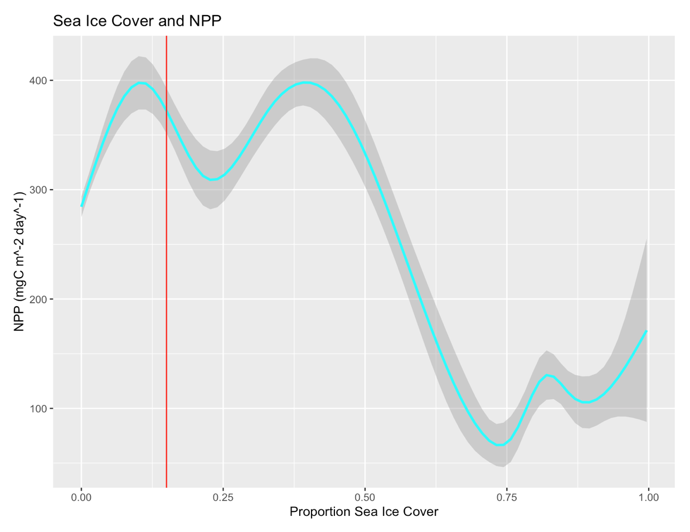

# Analysis of Antarctic Petrel Foraging Trips

Antarctic Petrels (*Thalassoica antarctica*) are an important Antarctic sentinel species. They often gather in large flocks on icebergs during long periods at sea, meaning that the behavior and ecology of these birds can be a useful lens to study the health of the Antarctic. However, our understanding of the ecology and life history of these birds are incomplete.

  

156 petrels were tagged with GPS monitors at Svarthamaren, Dronning Maud Land, the largest known colony of Antarctic Petrels in the world. These data were originally collected to test for overlap between petrel forage routes and commercial krill fisheries. These GPS data were made publically available on Movebank (https://www.movebank.org/cms/movebank-main). I analyzed Antarctic Petrel foraging data over the austral summers of 2012-2014 for the Final project of my Avian Ecoloogy class in the spring of 2020. I plotted Petrel foraging paths, faceted by year and month. I observed high variability in foraging behavior and determined that the length of petrel forage trips were significantly different across different years.

  

I also clustered the Petrel foraging trips using Partitioning Around Medoids (PAM) Clustering to identify prototypical petrel foraging trips during different years.

  

To determine possible causes of this variability, I visualized the pretrel foraging trips in light of remote sensing data, corresponding to various environmental variables like sea surface temperature, bathymetric depth, net primary production, locations of large icebergs, and sea ice cover. After integrating these data, I identified a phenomenon where petrels tended to forage in regions of low to moderate sea ice cover (<50% cover), a threshold that corresponds to the sea ice edge. 

  

  

This finding was supported by the scientific literature (Delord, K. et al., R. Soc. Open Sci. 7, 2020). Exploratory plots indicated that lower sea ice cover corresponded to higher Net Primary Production, providing ecological justification for this phenomenon. This project represented a data-driven approach to understand the ecology of an important Antarctic sentinel species.

